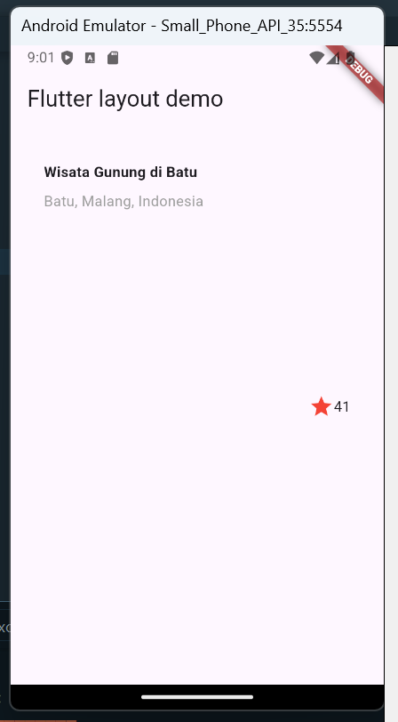
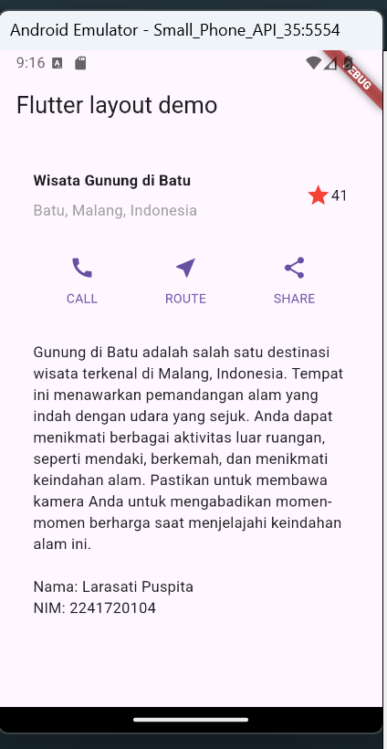
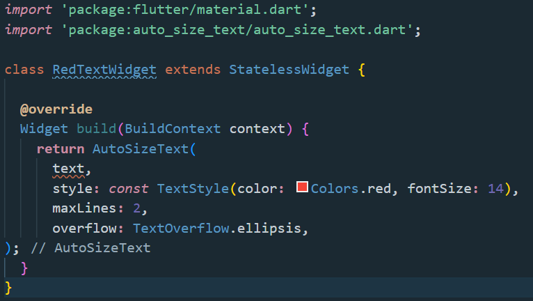
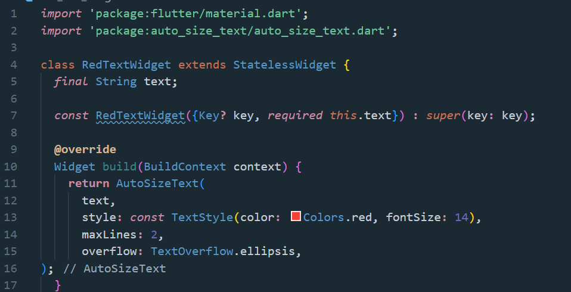
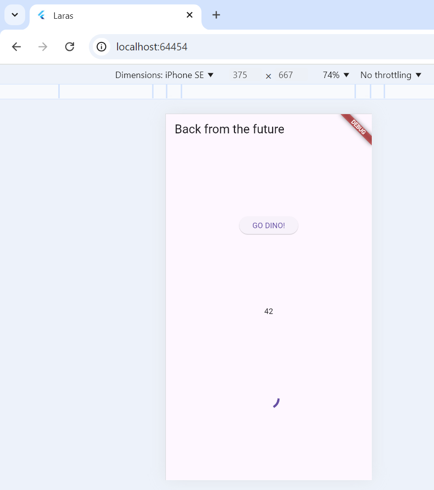

# Laporan Praktikum Manajemen Plugin
Nama    : Larasati Puspita Candra Dewi
NIM     : 2241720104
Kelas   : TI-2B
Absen   : 16

## Praktikum 7
### Menambahkan plugin

### Buat file red_text_widget

### Tambah widget autosizetext

### Buat variabel text dan parameter di constructor

### Tambahkan widget di main.dart

## Tugas
1. Selesaikan Praktikum tersebut, lalu dokumentasikan dan push ke repository Anda berupa screenshot hasil pekerjaan beserta penjelasannya di file README.md!
2. Jelaskan maksud dari langkah 2 pada praktikum tersebut!

Jawab :

pada kode dilangkah 2 digunakan untuk menambahkan package auto_size_text ke dalam proyek Flutter. package tersebut akan ditambahkan pada file pubspec.yaml pada bagian dependencies. Fungsi dari AutoSizeText adalah secara otomatis mengubah ukuran font teks agar sesuai dengan ruang yang tersedia. 

3. Jelaskan maksud dari langkah 5 pada praktikum tersebut!

Jawab :

Kode program untuk mendefinisikan variabel dan parameter dalam konstruktor untuk widget RedTextWidget. Dimana memungkinka kita untuk membuat widget yang dapat menerima dan menampilkan teks yang diberikan saat instansi widgett tersebut dibuat.

4. Pada langkah 6 terdapat dua widget yang ditambahkan, jelaskan fungsi dan perbedaannya!

Jawab :

pada widget pertama menggunakan widget RedTextWidget dimana container ini bertujuan untuk menampilkan informasi dengan cara lebih menonjol dengan warna merah. sedangkan pada widget kedua menggunakan widget Text yang bertujuan menampilkan informasi yang sama dengan cara yang lebih sama dan menggunakan warna yang lebih netral hijau.

5. Jelaskan maksud dari tiap parameter yang ada di dalam plugin auto_size_text berdasarkan tautan pada dokumentasi ini !

Jawab :

Berikut adalah penjelasan singkat untuk tiap parameter yang ada di dalam plugin `auto_size_text`:

1. key: Parameter opsional yang digunakan untuk mengidentifikasi widget secara unik dalam widget tree Flutter.
2. textKey: Kunci khusus untuk teks, memungkinkan akses langsung ke widget teks yang terukur untuk mempermudah pengelolaan.
3. style: Menentukan gaya teks yang akan diterapkan pada teks yang ditampilkan, seperti ukuran, warna, dan font.
4. minFontSize: Menetapkan ukuran font minimum yang dapat digunakan agar teks tidak terlalu kecil untuk dibaca.
5. maxFontSize: Menentukan ukuran font maksimum yang akan diterapkan pada teks untuk menghindari tampilan yang terlalu besar.
6. stepGranularity: Menentukan langkah perubahan ukuran font saat menyesuaikan, memberikan kontrol yang lebih halus atas ukuran font.
7. presentFontSizes: Daftar ukuran font yang akan dipertimbangkan saat menyesuaikan ukuran teks, memungkinkan penyesuaian ukuran yang lebih spesifik.
8. group: Parameter untuk mengelompokkan beberapa widget `AutoSizeText` sehingga mereka dapat berbagi batasan ukuran font.
9. textAlign: Menentukan bagaimana teks akan disejajarkan dalam wadahnya, seperti kiri, kanan, tengah, atau justify.
10. textDirection: Menentukan arah teks, baik dari kiri ke kanan (LTR) atau dari kanan ke kiri (RTL).
11. locale: Menentukan pengaturan lokal yang akan digunakan untuk teks, yang dapat memengaruhi format teks dan penampilan.
12. softWrap: Parameter yang mengontrol apakah teks akan dibungkus ke baris berikutnya saat mencapai batas lebar wadah.
13. wrapWords: Menentukan apakah kata-kata akan dibungkus ke baris baru atau tidak, memberikan kontrol lebih besar atas tata letak teks.
14. overflow: Menentukan bagaimana teks yang melebihi batas wadah akan ditangani, seperti memotong, menampilkan titik-titik, atau mengganti dengan teks alternatif.
15. overflowReplacement: Teks alternatif yang ditampilkan ketika terjadi overflow, memberikan pengguna informasi tentang teks yang hilang atau tidak ditampilkan.

6. Kumpulkan laporan praktikum Anda berupa link repository GitHub kepada dosen!