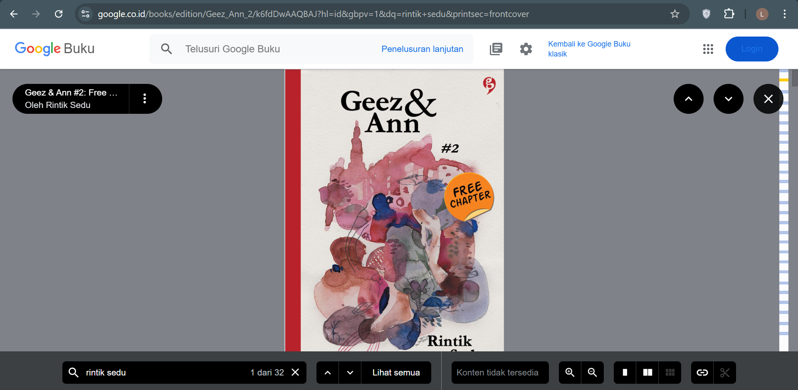
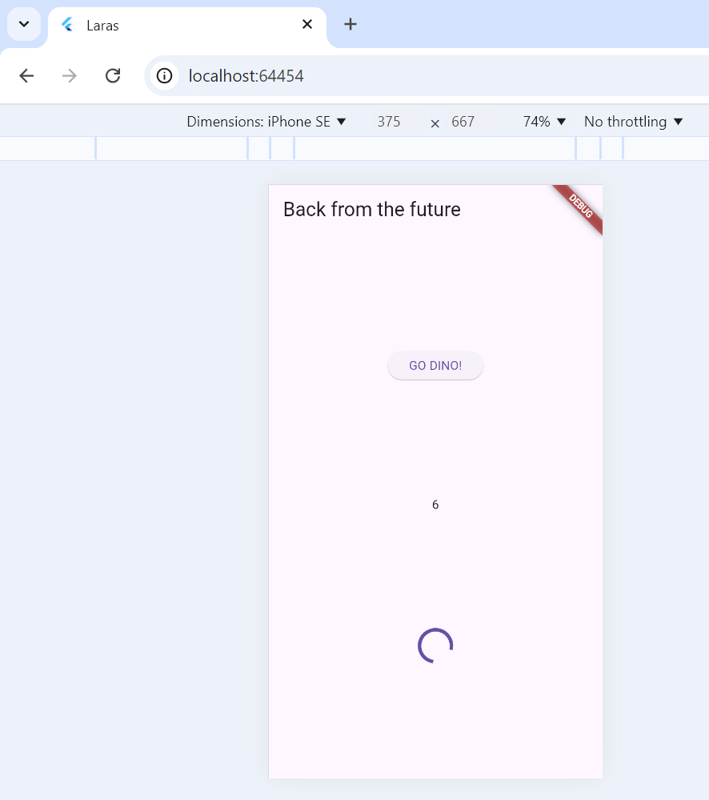
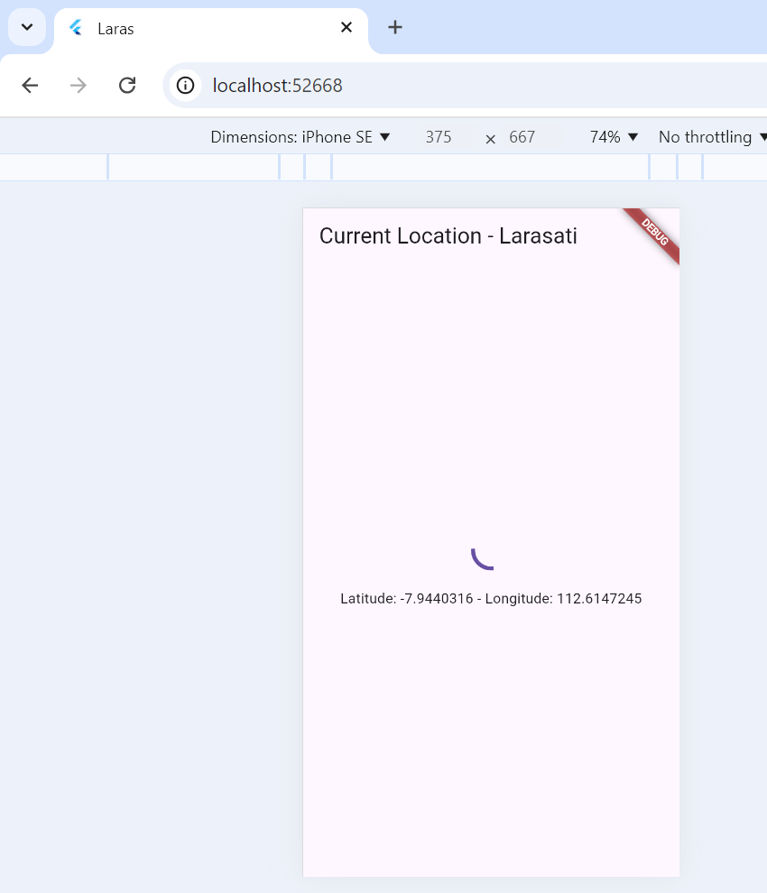
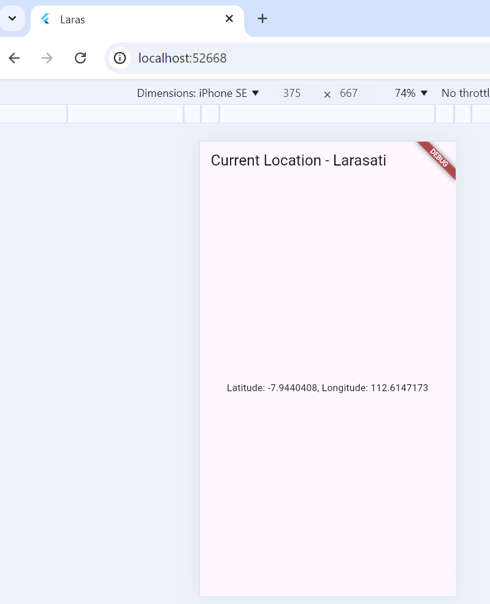
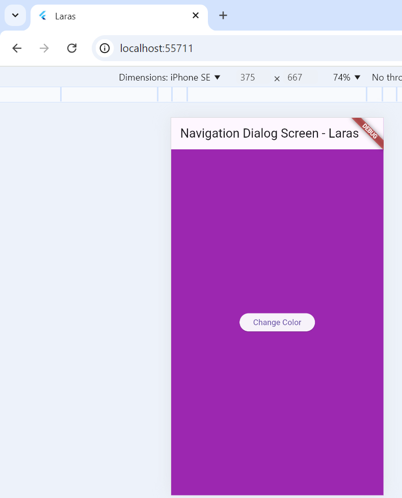

# Laporan Praktikum Pemrograman Asynchronous
Nama    : Larasati Puspita Candra Dewi
NIM     : 2241720104
Kelas   : TI-2B
Absen   : 16

## Praktikum 1 : Mengunduh Data dari Web Service (API)
### Soal 1
Tambahkan nama panggilan Anda pada title app sebagai identitas hasil pekerjaan Anda.

### Soal 2
Carilah judul buku favorit Anda di Google Books, lalu ganti ID buku pada variabel path di kode tersebut. Caranya ambil di URL browser Anda seperti gambar berikut ini.

Kemudian cobalah akses di browser URI tersebut dengan lengkap seperti ini. Jika menampilkan data JSON, maka Anda telah berhasil. Lakukan capture milik Anda dan tulis di README pada laporan praktikum. Lalu lakukan commit dengan pesan "W12: Soal 2".

### Soal 3
Jelaskan maksud kode langkah 5 tersebut terkait substring dan catchError!

Pada langkah 5, kode menggunakan `substring` dan `catchError` untuk memproses data dan menangani kesalahan. Setelah tombol ditekan, fungsi `getData` dipanggil untuk mengambil data dari API Google Books. Jika data berhasil diambil, `substring(0, 450)` akan memotong teks menjadi 450 karakter pertama saja agar tampilannya lebih ringkas di aplikasi. Jika terjadi kesalahan saat mengambil data (misalnya, masalah jaringan), `catchError` akan menampilkan teks "Error" sebagai pengganti data, sehingga aplikasi tetap memberikan respons yang jelas meskipun gagal mengambil data.

### Soal 4
Jelaskan maksud kode langkah 1 dan 2 tersebut

Pada langkah 1, terdapat tiga fungsi `returnOneAsync`, `returnTwoAsync`, dan `returnThreeAsync`, masing-masing mengembalikan angka (1, 2, dan 3) setelah menunggu tiga detik. Setiap fungsi menggunakan `Future.delayed` untuk memberikan jeda waktu tiga detik sebelum hasil dikembalikan, sehingga proses ini mensimulasikan operasi yang memerlukan waktu (seperti mengambil data dari server).

Langkah 2 mendefinisikan fungsi `count`, yang menjalankan ketiga fungsi dari langkah 1 secara berurutan dan menjumlahkan hasilnya. Pertama, `total` diinisialisasi dengan hasil dari `returnOneAsync`, kemudian ditambahkan hasil dari `returnTwoAsync`, dan akhirnya `returnThreeAsync`. Setelah semua operasi selesai, `setState` memperbarui nilai `result` dengan total yang diperoleh. Fungsi ini memastikan bahwa hasil akhir ditampilkan di UI setelah proses penjumlahan selesai.

### Soal 5
Jelaskan maksud kode langkah 2 tersebut!

Pada langkah 2, `Completer` digunakan untuk mengontrol penyelesaian dari operasi asinkron secara manual. Fungsi `getNumber` membuat objek `Completer<int>` dan memulai fungsi `calculate`. Fungsi `calculate` menunda eksekusi selama lima detik menggunakan `Future.delayed`, kemudian memanggil `completer.complete(42)` untuk menetapkan nilai `42` sebagai hasil `Completer`. Nilai ini diakses oleh `getNumber().then(...)` di tombol `GO DINO!`, yang memperbarui nilai `result` pada UI setelah proses selesai.

### Soal 6
Jelaskan maksud perbedaan kode langkah 2 dengan langkah 5-6 tersebut!

Perbedaan utama dalam kode terbaru adalah penanganan error menggunakan `completeError` pada `Completer` di fungsi `calculate`. Dalam kode sebelumnya, `Completer` menyelesaikan proses hanya dengan nilai `42`, sedangkan pada kode terbaru, jika ada error, `calculate` akan memanggil `completer.completeError`, yang memungkinkan `catchError` pada `getNumber()` di `onPressed` untuk menampilkan pesan error. Ini membuat kode lebih andal dalam menangani potensi kegagalan selama pemrosesan asynchronous.

### Soal 7
Capture hasil praktikum Anda berupa GIF dan lampirkan di README. Lalu lakukan commit dengan pesan "W12: Soal 7".

### Soal 8
Jelaskan maksud perbedaan kode langkah 1 dan 4!

Perbedaan utama antara kode ini dengan kode sebelumnya terletak pada implementasi fungsi `returnFG()`. Pada kode sebelumnya, `returnFG()` menggunakan `FutureGroup` dari paket `async` untuk mengelompokkan tiga `Future` (`returnOneAsync`, `returnTwoAsync`, dan `returnThreeAsync`) dan menjalankan mereka secara paralel. Sedangkan dalam kode saat ini, `returnFG()` menggunakan `Future.wait`, fungsi bawaan Flutter, untuk mencapai hasil serupa tanpa menggunakan `FutureGroup`. `Future.wait` memungkinkan penanganan semua `Future` sekaligus dan mengembalikan hasilnya dalam bentuk `List`. Hal ini mengurangi dependensi eksternal dan menyederhanakan kode, tetapi hasil akhirnya tetap sama.

### Soal 9
Capture hasil praktikum Anda berupa GIF dan lampirkan di README. Lalu lakukan commit dengan pesan "W12: Soal 9".

### Soal 10
Panggil method handleError() tersebut di ElevatedButton, lalu run. Apa hasilnya? Jelaskan perbedaan kode langkah 1 dan 4!

Perbedaan utama antara kode pertama dan kode kedua terletak pada penanganan error. Pada kode pertama, error ditangani menggunakan `then()`, `catchError()`, dan `whenComplete()` dalam method `onPressed`. Sedangkan pada kode kedua, penanganan error dilakukan dengan menggunakan `try-catch-finally` di dalam method `handleError()`, yang kemudian dipanggil di dalam `onPressed`. Dalam kode kedua, setelah menangani error, `finally` akan selalu dipanggil, terlepas dari apakah error terjadi atau tidak, yang memastikan bahwa `print('Complete')` selalu dijalankan. Kode kedua lebih sederhana dan menggunakan pendekatan tradisional untuk menangani error dengan `try-catch-finally`, sementara kode pertama menggunakan chaining Future dengan `then`, `catchError`, dan `whenComplete`.

### Soal 11
Tambahkan nama panggilan Anda pada tiap properti title sebagai identitas pekerjaan Anda.

### Soal 12
Jika Anda tidak melihat animasi loading tampil, kemungkinan itu berjalan sangat cepat. Tambahkan delay pada method getPosition() dengan kode await Future.delayed(const Duration(seconds: 3));

Apakah Anda mendapatkan koordinat GPS ketika run di browser? Mengapa demikian?

Tidak sepenuhnya berhasil, hanya latitude yang berhasil ditampilkan, sementara longitude mengalami kesalahan tampilan karena penggunaan string literal yang tidak tepat. Masalah ini terjadi karena pada bagian longitude, seharusnya menggunakan interpolasi string yang benar dalam kode. Untuk menampilkan nilai variabel dengan benar, perlu menggunakan sintaks `${}`.

### Soal 13
Apakah ada perbedaan UI dengan praktikum sebelumnya? Mengapa demikian?
Tentu, berikut adalah parafrase dari penjelasan tersebut:

Ya, terdapat perbedaan pada antarmuka pengguna (UI). Dengan menggunakan FutureBuilder, UI dapat secara otomatis menanggapi status dari Future. Saat data sedang diproses, FutureBuilder akan menampilkan indikator pemuatan (CircularProgressIndicator). Begitu data tersedia, UI akan menampilkan posisi pengguna tanpa perlu memanggil setState(), sehingga membuatnya lebih efisien dan lebih rapi.

Capture hasil praktikum Anda berupa GIF dan lampirkan di README. Lalu lakukan commit dengan pesan "W12: Soal 13".

### Soal 14
Apakah ada perbedaan UI dengan langkah sebelumnya? Mengapa demikian?

Benar, dengan penanganan kesalahan yang ditambahkan, UI menjadi lebih kuat. Jika terjadi masalah saat mendapatkan posisi, pengguna akan menerima umpan balik berupa pesan yang menjelaskan adanya kesalahan, daripada hanya menampilkan data yang kosong. Hal ini meningkatkan interaksi dan pemahaman pengguna mengenai kondisi aplikasi.

Capture hasil praktikum Anda berupa GIF dan lampirkan di README. Lalu lakukan commit dengan pesan "W12: Soal 14".

### Soal 15
Tambahkan nama panggilan Anda pada tiap properti title sebagai identitas pekerjaan Anda.
Silakan ganti dengan warna tema favorit Anda.

### Soal 16
Cobalah klik setiap button, apa yang terjadi ? Mengapa demikian ?

Ketika tombol "Change Color" ditekan, aplikasi mengubah warna latar belakang layar menjadi warna baru yang bisa acak atau mengikuti urutan tertentu. Setiap kali tombol diklik, warna latar belakang akan berubah dan perubahan tersebut terlihat di layar. Perubahan warna ini kemungkinan dipicu oleh fungsi yang dipanggil setiap kali tombol ditekan. Fungsi tersebut mungkin menggunakan metode seperti `setState()` (jika menggunakan Flutter) untuk memperbarui tampilan dengan warna yang baru. Setiap kali `setState()` dijalankan, layar akan diperbarui dengan nilai warna yang telah diubah.

Gantilah 3 warna pada langkah 5 dengan warna favorit Anda!

### Soal 17
Cobalah klik setiap button, apa yang terjadi ? Mengapa demikian ?

Ketika Anda mengklik salah satu tombol warna di dalam dialog (merah, hijau, atau biru), warna latar belakang layar akan berubah sesuai dengan warna yang dipilih. Setiap tombol akan mengubah nilai variabel `color` menggunakan `setState()`, yang memicu pembaruan UI dengan warna yang baru. Setelah perubahan warna dilakukan, perintah `Navigator.pop(context)` menutup dialog dan menampilkan latar belakang yang telah diperbarui.

Gantilah 3 warna pada langkah 3 dengan warna favorit Anda!

