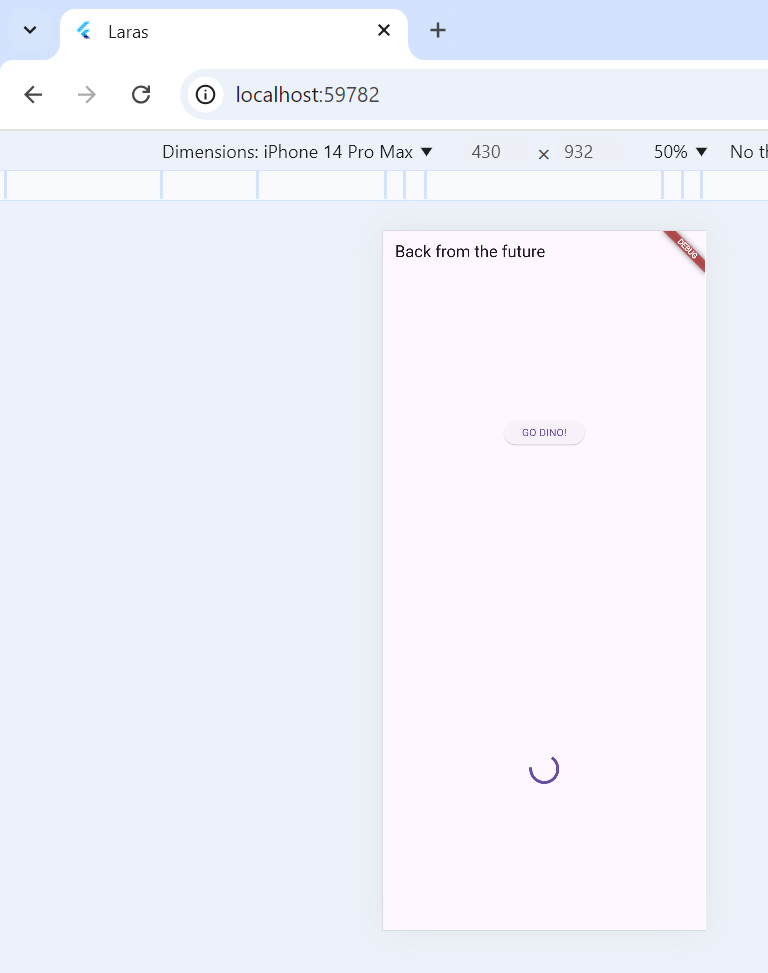
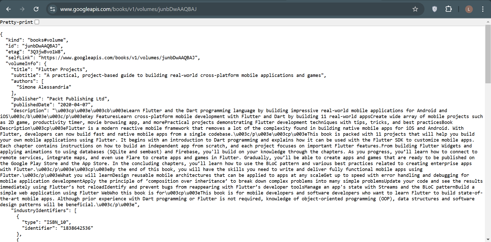

# Laporan Praktikum Manajemen Plugin
Nama    : Larasati Puspita Candra Dewi
NIM     : 2241720104
Kelas   : TI-2B
Absen   : 16

## Kamera
1. Selesaikan Praktikum 1 dan 2, lalu dokumentasikan dan push ke repository Anda berupa screenshot setiap hasil pekerjaan beserta penjelasannya di file README.md! Jika terdapat error atau kode yang tidak dapat berjalan, silakan Anda perbaiki sesuai tujuan aplikasi dibuat!
Hasil Praktikum 1 :

Hasil Praktikum 2  :

2. Gabungkan hasil praktikum 1 dengan hasil praktikum 2 sehingga setelah melakukan pengambilan foto, dapat dibuat filter carouselnya!
Hasil gabungan :

3. Jelaskan maksud void async pada praktikum 1?

Jawab :
Fungsi async dalam kode program ini digunakan untuk menandai bahwa sebuah fungsi bersifat asinkron, yang berarti dapat menjalankan tugas secara paralel tanpa menghalangi eksekusi program lainnya. Pada fungsi main, async digunakan untuk memastikan bahwa fungsi availableCameras() yang memerlukan waktu untuk mengambil daftar kamera tersedia dapat dieksekusi terlebih dahulu sebelum melanjutkan untuk menjalankan aplikasi dengan runApp(). Dengan demikian, await digunakan untuk menunggu hasil dari availableCameras() dan memastikan data kamera tersedia sebelum melanjutkan proses aplikasi.

4. Jelaskan fungsi dari anotasi @immutable dan @override ?

Jawab :
Anotasi @immutable digunakan untuk menandakan bahwa objek atau class tersebut tidak boleh diubah setelah dibuat. Artinya, semua field dalam class yang diberi anotasi ini harus bersifat final. Sementara itu, anotasi @override digunakan untuk menunjukkan bahwa suatu metode atau fungsi di dalam subclass mengubah atau menggantikan implementasi dari metode yang ada di superclass-nya.

5. Kumpulkan link commit repository GitHub Anda kepada dosen yang telah disepakati!