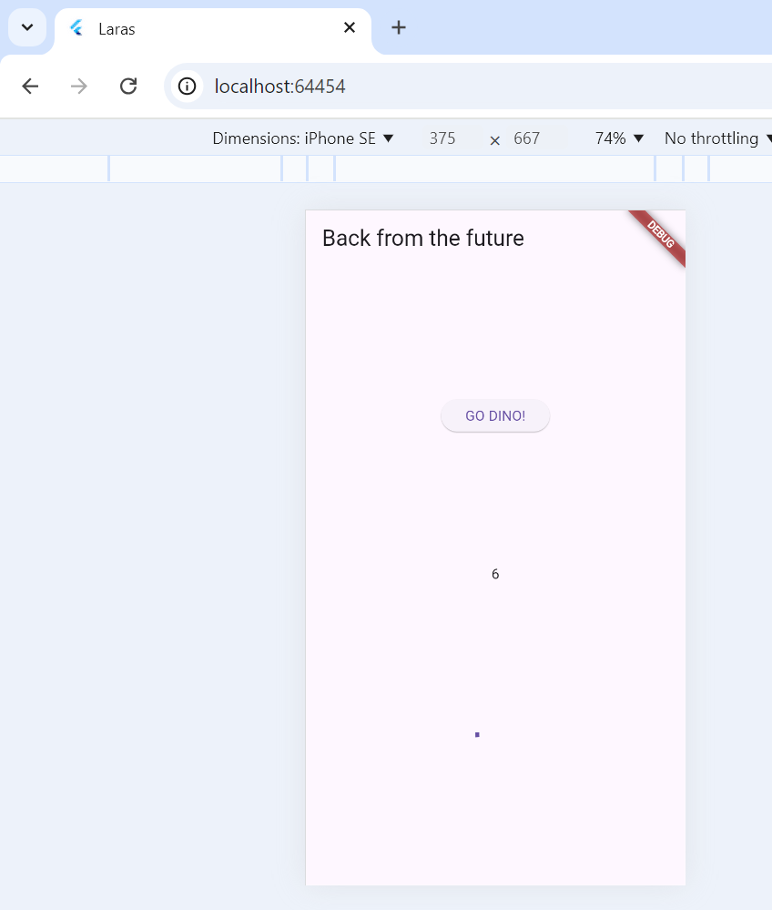

# Laporan Praktikum Layout dan Navigasi
Nama    : Larasati Puspita Candra Dewi
NIM     : 2241720104
Kelas   : TI-2B
Absen   : 16

## Praktikum 5
### Membangun Navigasi Di Flutter


```
Pada praktikum ini saya mempelajari beberap poin berikut :

1. Navigasi Antar Halaman: Kita belajar cara berpindah antar halaman menggunakan `Navigator.pushNamed` dan juga mengirim data antar halaman dengan argument, seperti mengirim data item dari `HomePage` ke `ItemPage`.

2. ListView dan Penggunaan Model: Dalam menampilkan daftar data, kita menggunakan `ListView.builder` yang mengambil data dari model `Item`, sehingga setiap item dalam list bisa ditampilkan secara dinamis.

3. Interaksi dengan InkWell: Kita menggunakan `InkWell` untuk membuat item dalam daftar bisa ditekan, lengkap dengan efek visual saat disentuh, dan menjalankan aksi ketika item tersebut dipilih.

4. Membuat Model Data: Kita belajar membuat kelas `Item` yang berfungsi sebagai model data untuk menyimpan informasi item seperti nama dan harga.
```
## Tugas 2
1. Untuk melakukan pengiriman data ke halaman berikutnya, cukup menambahkan informasi arguments pada penggunaan Navigator. Perbarui kode pada bagian Navigator menjadi seperti berikut.


2. Pembacaan nilai yang dikirimkan pada halaman sebelumnya dapat dilakukan menggunakan ModalRoute. Tambahkan kode berikut pada blok fungsi build dalam halaman ItemPage. Setelah nilai didapatkan, anda dapat menggunakannya seperti penggunaan variabel pada umumnya



3. Pada hasil akhir dari aplikasi belanja yang telah anda selesaikan, tambahkan atribut foto produk, stok, dan rating. Ubahlah tampilan menjadi GridView seperti di aplikasi marketplace pada umumnya.


4. Silakan implementasikan Hero widget pada aplikasi belanja Anda dengan mempelajari dari sumber ini: https://docs.flutter.dev/cookbook/navigation/hero-animations


5. Sesuaikan dan modifikasi tampilan sehingga menjadi aplikasi yang menarik. Selain itu, pecah widget menjadi kode yang lebih kecil. Tambahkan Nama dan NIM di footer aplikasi belanja Anda.

