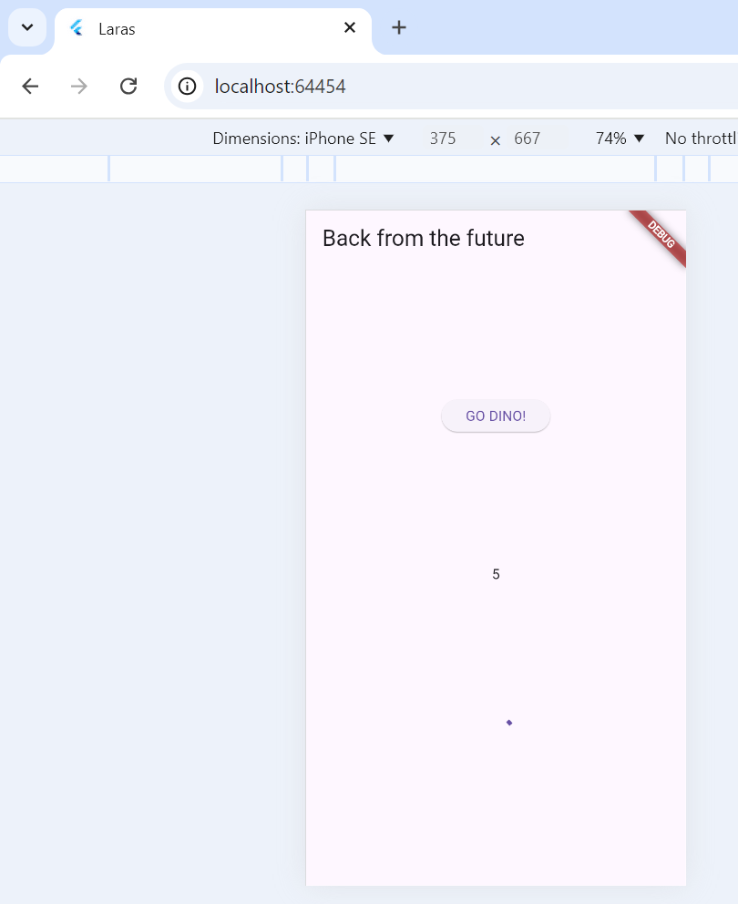
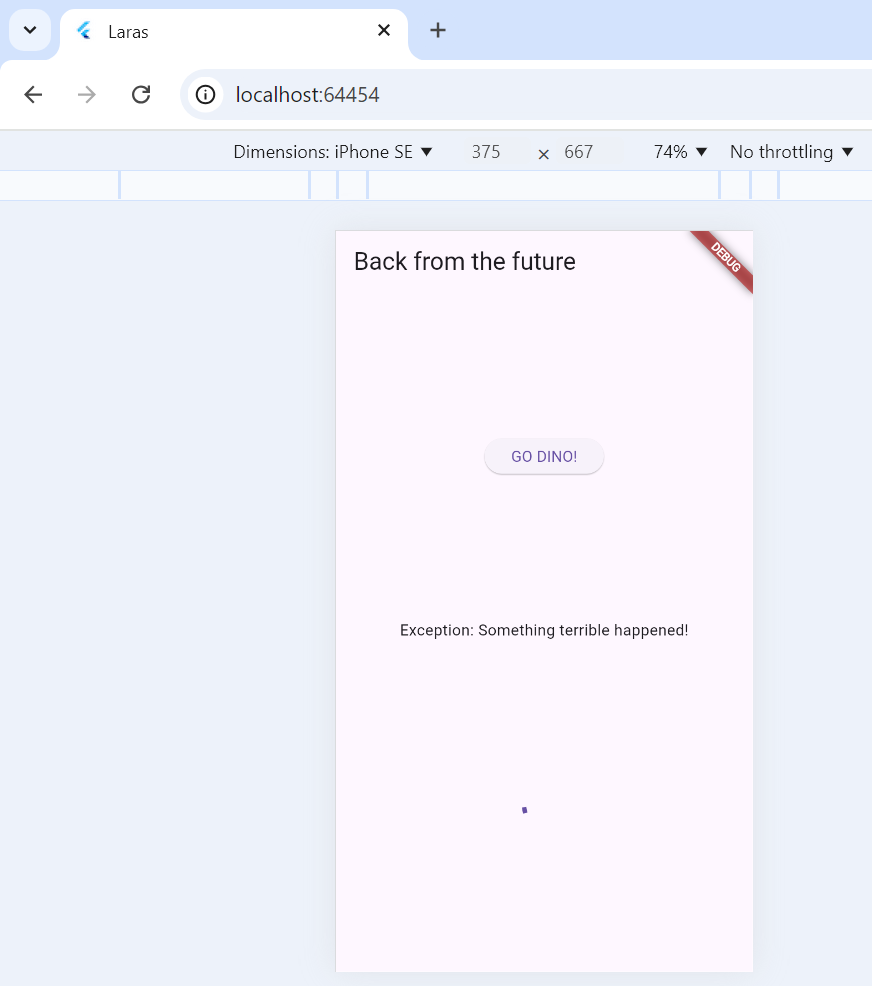
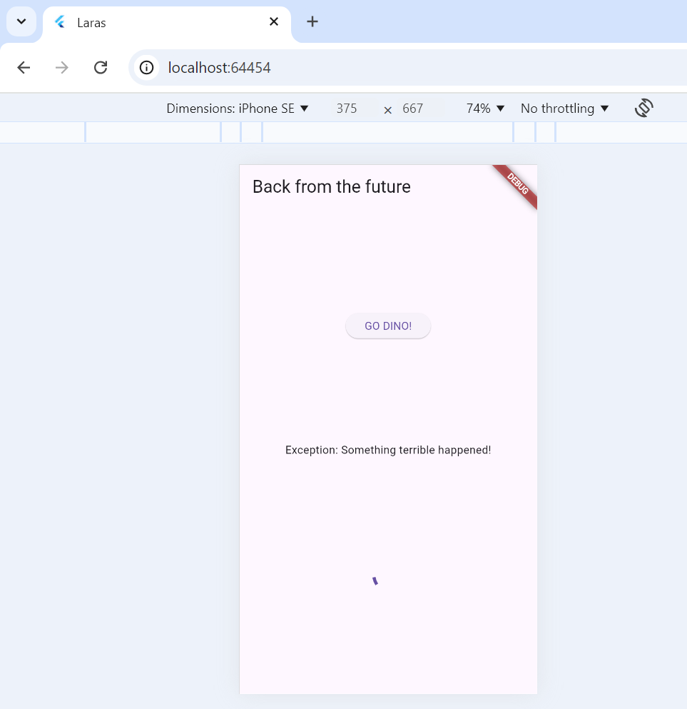
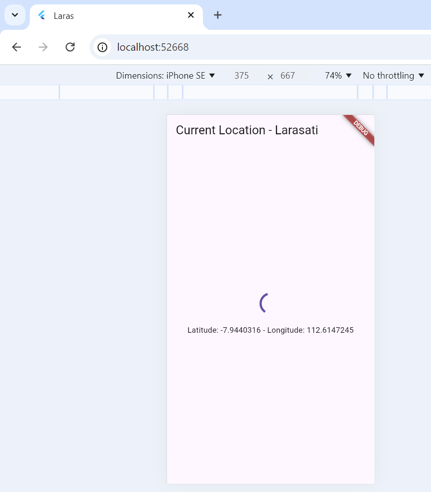
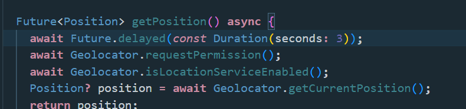

# Laporan Praktikum 1 Aplikasi Pertama dan Widget Dasar Flutter 
``` 
Nama    : Larasati Puspita Candra Dewi
NIM     : 2241720104
Kelas   : TI-2B
Absen   : 16
```

## Praktikum 1
### Membuat project flutter 


## Praktikum 3
### Membuat repositery github


### Membuat Laporan Md


### Menjalankan project flutter


## Praktikum 4
### Pembuatan Text Widget


### Pembuatan Image Widget


## Praktikum 5
### Pembuatan Loading Cupertino


### Pembuatan Floating Action Button


### Pembuatan Scallfold Widget


### Pembuatan Dialog Widget


### Pembuatan Text Field Widget


### Pembuatan Date & Time Picker


# Laporan Praktikum Codelabs: Your First Flutter App
### Pembuatan Project
``` sudah dilakukan pada tahap sebelumnya ```

### Menambahkan Tombol


### Memperindah Tampilan Aplikasi


### Menambahkan Fungsi Button Favorit


### Menambahkan Kolom Samping Navigasi


### Menambahkan Halaman Baru

